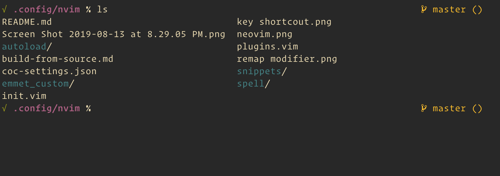

# Dotfiles

Personal dotfiles managed with [GNU Stow](https://www.gnu.org/software/stow/).

Each top-level folder is a Stow package that symlinks files into `$HOME`.

Examples:

- `zsh/.zshrc` -> `~/.zshrc`
- `git/.gitconfig` -> `~/.gitconfig`
- `neovim/.config/nvim` -> `~/.config/nvim`

The Neovim setup is a local [LazyVim](https://github.com/LazyVim/LazyVim) config, not because I'm lazy, but because I take doing absolutely nothing very seriously.



## Install

One-liner — clones the repo, installs `stow` if missing, then opens an interactive picker so you can choose which packages to stow:

```sh
curl -fsSL https://raw.githubusercontent.com/juanramirezc2/dotfiles/local-lazy/install.sh | bash
```

Non-interactive (skip the picker):

```sh
curl -fsSL https://raw.githubusercontent.com/juanramirezc2/dotfiles/local-lazy/install.sh \
  | DOTFILES_PACKAGES=zsh,git,neovim,tmux bash
```

Env-var overrides: `DOTFILES_DIR` (default `~/dotfiles`), `DOTFILES_REPO`, `DOTFILES_BRANCH`, `DOTFILES_PACKAGES`, `DOTFILES_ADOPT=1` (use `stow --adopt` to absorb existing files).

Manual install:

```sh
git clone git@github.com:juanramirezc2/dotfiles.git ~/dotfiles
brew install stow
cd ~/dotfiles
```

## Usage

Stow the packages you want:

```sh
stow --target="$HOME" zsh git neovim tmux
```

Stow a single package:

```sh
stow --target="$HOME" ghostty
```

Remove a package:

```sh
stow -D --target="$HOME" neovim
```
